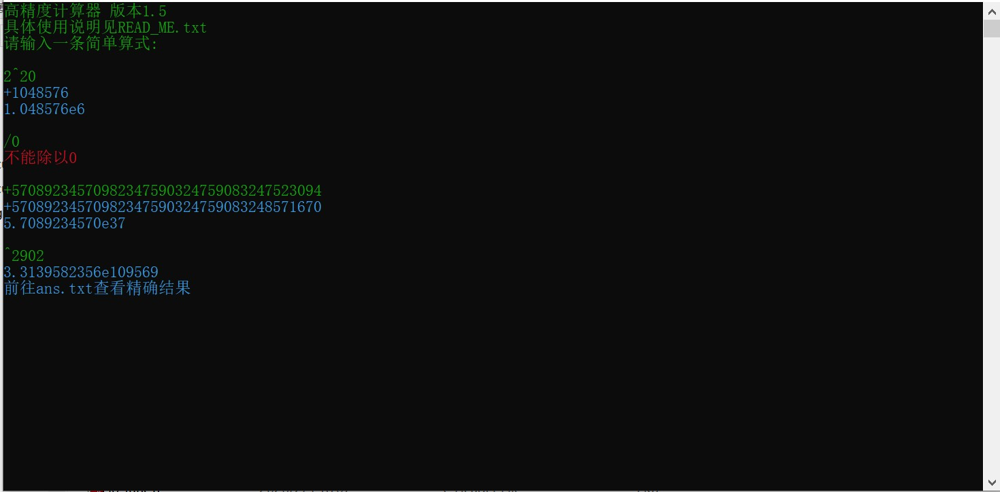

# GreatCalculator

🔥 一个小巧高效的C++高精度计算器，包含加减乘除、乘方、取模、按位与、按位或、按位异或

## 🎯 核心特性
- ✅ **无第三方依赖**：不依赖 GMP、Boost 等任何库
- ✅ **千进制存储**：速度优于传统十进制
- ✅ **Karatsuba 分治乘法**：大数乘法性能大幅提升
- ✅ **估商除法**：估商+微调，效率优于朴素试商除法
- ✅ **支持位运算**：`& | !(按位异或)`
- ✅ **错误安全**：运算前进行错误检查

## ⚠️ 注意事项
1. 仅支持有符号大整数，不支持浮点数
2. 负数取模规则：余数与被除数同号
3. 指数超过 8 位时，提示结果过大难以计算
5. 最大长度限制：理论上int的最大值
6. 若希望避免文件操作，请在编译时加入-DNOFILE

## 📧 作者
天辰

lyrTianChen09@outlook.com

## 📄 许可证
开源免费，可自由使用、修改、分发
